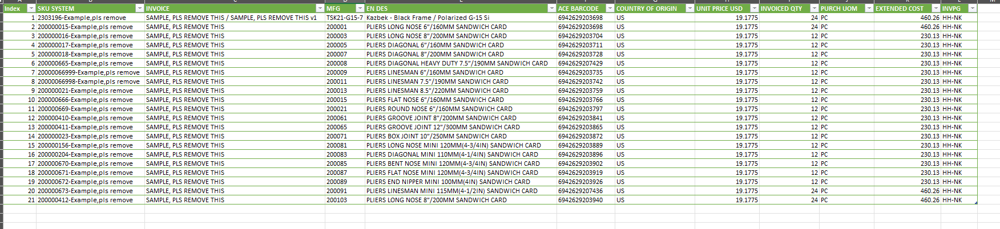

# 🤝 Collaborative Import Workflow Optimization  

---

## 📘 Giới thiệu
Trong quy trình nhập khẩu, phòng Merchandise cần cung cấp nhiều dữ liệu cho bộ phận Logistic.  
Tuy nhiên, trước đây việc xử lý dữ liệu gặp nhiều vấn đề nghiêm trọng:  

1. **Thiếu nơi làm việc tập trung** – mỗi thành viên xử lý dữ liệu độc lập, dẫn đến trùng lặp và tốn thời gian.  
2. **Hạn chế kỹ năng Excel** – nhiều lỗi khi tổng hợp thủ công các Commercial Invoice, đặc biệt với SKU trùng lặp.  
3. **Thiếu khả năng theo dõi tiến độ** – Quản lý không thể biết dữ liệu đã được xử lý đến đâu, bởi không có hệ thống chung.  

Dự án **Collaborative Import Workflow Optimization** được thực hiện để giải quyết triệt để các vấn đề trên, hướng tới một quy trình làm việc tập trung, nhanh chóng và minh bạch.

---

## 🎯 Mục tiêu dự án
- Tạo **file làm việc chung** cho toàn bộ team Merchandise.  
- **Chuẩn hóa table mẫu** để điền thông tin theo đúng định dạng.  
- **Tự động tổng hợp dữ liệu** bằng công cụ có sẵn trong Excel thay vì thao tác tay.  
- Giúp Quản lý **theo dõi tiến độ xử lý thông tin** dễ dàng và rõ ràng hơn.

---

## 🧩 Giải pháp thực hiện
- **Thảo luận với toàn bộ team** để xây dựng table mẫu hoàn chỉnh, chứa tất cả trường dữ liệu cần thiết.  
- **Phân chia công việc rõ ràng**, mỗi thành viên chịu trách nhiệm phần riêng trong table.  
- Sử dụng Pivot Table để tổng hợp dữ liệu nhanh, giảm lỗi thủ công.

---

## 📊 Kết quả đạt được
- **Hiệu suất xử lý tăng gấp 3 lần** so với trước.  
- **Sai sót gần như bằng 0** nhờ loại bỏ thao tác thủ công.  
- **Tăng tính minh bạch**, quản lý nắm được tiến độ xử lý theo thời gian thực.  
- **Tăng khả năng phối hợp giữa các thành viên**, giảm trùng lặp công việc.  
- **Cải thiện luồng thông tin liên phòng ban** giữa Merchandise và Logistic.  

---

## 🛠️ Công cụ & Kỹ thuật sử dụng
- **Excel** (Data Table, Power Query, Pivot Table)  
- **Team Collaboration & Communication**  
- **Process Streamlining**  
- **Workflow Optimization**  
- **Data Cleaning & Structuring**  

---

## 📆 Cập nhật 

  
🔹 2025.08 – Tối ưu kết quả tổng hợp dữ liệu

   
  <ul>
    <li>Phát hiện hạn chế của Pivot Table trong việc xuất dữ liệu theo định dạng chuẩn.</li>
    <li>Chuyển sang Power Query để làm sạch dữ liệu, tính toán chỉ số, và xuất dữ liệu đã chuẩn hóa.</li>
    <li>Loại bỏ các cột không cần thiết, chỉ giữ lại trường dữ liệu quan trọng cho team kế tiếp.</li>
    <li>Sắp xếp lại cấu trúc output sao cho thân thiện và tiện lợi nhất cho bước kế tiếp trong quy trình.</li>
  </ul>

  
🔹 2025.08 – Tạo template mẫu tiêu chuẩn

   
  <ul>
    <li>Tạo 1 mẫu tiêu chuẩn chứa sẵn các trường, queries trong power query sẵn có, khi có đơn hàng nhập khẩu mới thì chỉ cần copy template này ra và điền thông tin vào, sau đó bấm refresh là xong. Điều này dễ dàng chuyển giao và vận hành mà không cần người tạo ra template trực tiếp vận hành</li>
  </ul>

  
🔹 2025.09 – Tối ưu "không gian" làm việc của từng thành viên & tiến độ công việc

   
  <ul>
    <li>Phát hiện hạn chế của "table khổng lồ" là:</li>
    <ol type=1>
      <li>Nó quá lớn, làm choáng ngợp cho các thành viên khi làm việc.</li>
      <li>Một vài SKU được lặp lại trong nhiều Commercial Invoice nhưng thông tin về sản phẩm như Material, Hazmat, Product Uses,... thì không cần thiết phải lặp lại</li>
      <li>Quản lý cần chi tiết hơn trong việc kiểm soát tiến độ từng thành viên trong từng giai đoạn khi nhập khẩu, cách làm hiện tại không đáp ứng được</li>
    </ol>
    <li>Giải pháp:</li>
    <ol type=1>
      <li>Chia nhỏ table lớn ra thành nhiều table nhỏ, với mỗi table chỉ 1 đến 2 thành viên làm việc</li>
      <li>Chia ra nhiều table nhỏ dựa trên tiến độ công việc, khi một table hoàn thành, điều này đồng nghĩa với việc tiến độ đã đến đó.</li>
      <li>Quản lý dễ dàng hơn trong việc nắm bắt tiến độ công việc.</li>
      <li>Thêm vào đó, có những dữ liệu phục vụ cho việc nhận diện, lưu trữ và phân tích chứ không hẳn là cho bộ phận logistic, nên việc chia nhỏ table cũng giúp xác định được dữ liệu nào là cần thiết, là gấp rút theo tiến độ, dữ liệu nào là để làm đầy đủ và toàn vẹn dữ liệu và sẽ làm nó sau này</li>
    </ol>
  </ul>

## 📸 Kết quả
### Hình ảnh minh họa

  

---

## 🧾 Ghi chú
Dự án này được thực hiện ngay sau dự án "Centralized Import Data Repository for Logistic Efficiency” nhằm tối ưu quy trình làm việc nội bộ trong quá trình mua hàng nhập khẩu của công ty.

Xem dự án liên quan này: [Tại đây](https://github.com/tramdangtai/import-data-repository)

## ✉️ Tác giả
**Tram Dang Tai**  
📍 Merchandise Assistant Database  
📧 [Liên hệ qua LinkedIn](https://www.linkedin.com/in/tramdangtai)
